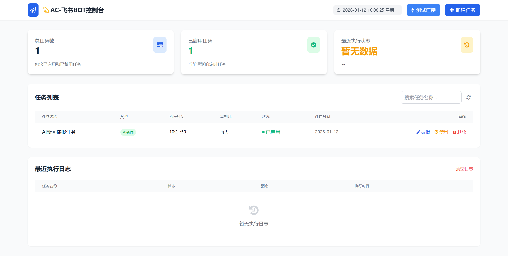
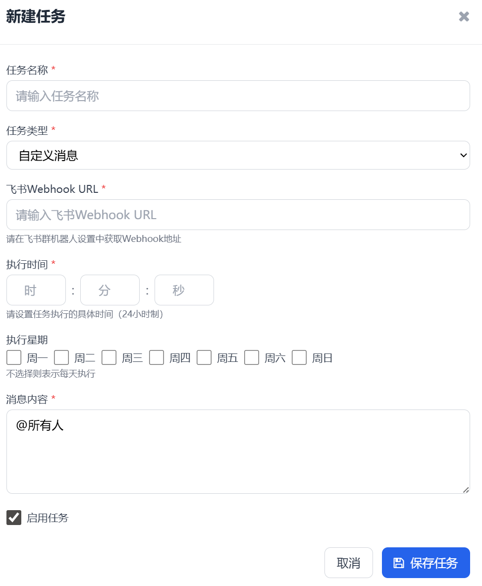
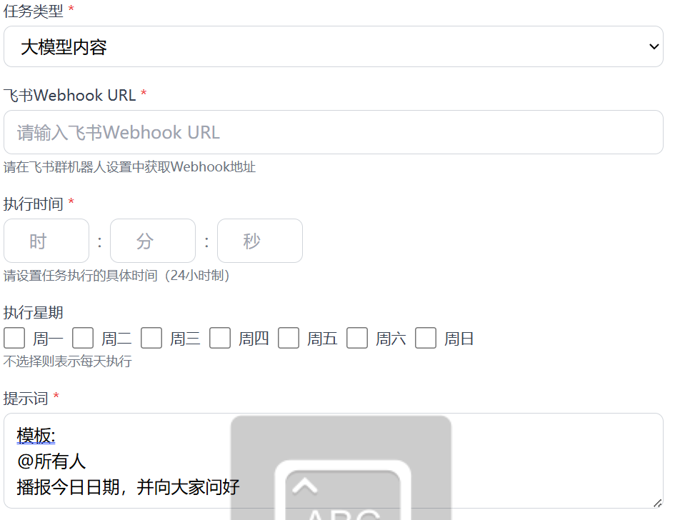

# 飞书群聊播报机器人

Python开发的飞书群聊播报机器人，支持定时向飞书群发送自定义消息、AI新闻(60s)和大模型生成的内容。



## 功能特点

- **支持多种播报内容**：自定义消息、AI新闻、大模型生成内容
- **灵活的定时配置**：支持精确到秒的时间设置，可选择一周中的特定几天
- **可视化管理界面**：友好的Web管理页面，支持任务的增删改查
- **Webhook测试功能**：方便测试飞书机器人连接是否正常
- **执行日志记录**：记录所有任务执行情况，便于问题排查
- **数据持久化**：使用SQLite数据库存储任务配置
- **分层架构设计**：清晰的代码结构，便于维护和扩展

## 项目结构

```
AC-bot/
├── app.py                 # 启动文件
├── controllers/           # 控制器层
│   ├── task_controller.py  # 任务相关接口
│   ├── log_controller.py   # 日志相关接口
│   └── test_controller.py  # 测试相关接口
├── services/              # 服务层
│   ├── task_service.py     # 任务业务逻辑
│   ├── log_service.py      # 日志业务逻辑
│   ├── feishu_service.py   # 飞书消息发送
│   └── ai_service.py       # AI新闻和大模型调用
├── models/                # 数据模型层
│   └── db.py               # 数据库连接和初始化
└── scheduler/             # 调度器
    └── task_scheduler.py   # 任务调度逻辑
```

## 安装指南

### 方法一：直接运行

```bash
python app.py
```

启动后，访问 `http://localhost:9096` 即可进入管理界面。

### 方法二：Docker部署

1. **确保已安装Docker**

2. **构建Docker镜像**

```bash
# 在项目根目录下执行
docker build -t feishu_bot .
```

3. **运行Docker容器**

```bash
docker run -d -p 9096:9096 --name feishu_bot-container AC-bot
```

```bash
docker run -d -p 9096:9096 -v ./feishu_bot.db:/app/AC.db --name feishu_bot-container AC-bot
```

4. **访问应用**

   启动后，访问 `http://localhost:9096` 即可进入管理界面。


## 使用说明

### 1. 创建飞书机器人

1. 打开飞书群聊设置
2. 选择「群机器人」
3. 点击「添加机器人」，选择「自定义机器人」
4. 填写机器人名称，获取Webhook地址

### 2. 创建播报任务

1. 在管理界面点击「新建任务」按钮
2. 填写任务名称和飞书Webhook地址
3. 选择任务类型（自定义消息/AI新闻/大模型内容）
4. 根据任务类型填写相应内容
5. 设置执行时间和执行周期（一周中的哪些天）
6. 点击「保存」完成创建

### 3. 测试Webhook连接

1. 在管理界面点击「测试连接」按钮
2. 输入飞书Webhook地址和测试消息
3. 点击「发送测试消息」，查看飞书群是否收到消息

### 4. 管理任务

- **编辑任务**：点击任务列表中的「编辑」按钮
- **启用/禁用任务**：点击任务列表中的「启用/禁用」按钮
- **删除任务**：点击任务列表中的「删除」按钮
- **手动执行任务**：点击任务列表中的「执行」按钮（待实现）

## 任务类型说明

### 自定义消息
用户可以输入任意文本内容，机器人将按照设定的时间发送到飞书群。

### AI新闻
自动从指定API获取最新AI行业新闻，格式化为飞书消息发送。

### 大模型内容
用户可以配置提示词和大模型API信息，机器人将调用大模型生成内容并发送。

## 注意事项

1. 请妥善保管飞书Webhook地址，避免泄露
2. 对于大模型类型任务，请妥善保管API密钥

## 常见问题

### Q: 消息发送失败怎么办？
A: 检查Webhook地址是否正确，可通过「测试连接」功能验证。

### Q: 如何在自定义消息或者大模型消息中@全员？
A: 保证飞书消息中有"@所有人”即可




### Q: 服务重启后任务会丢失吗？
A: 不会，任务配置存储在SQLite数据库中，重启后会自动加载。